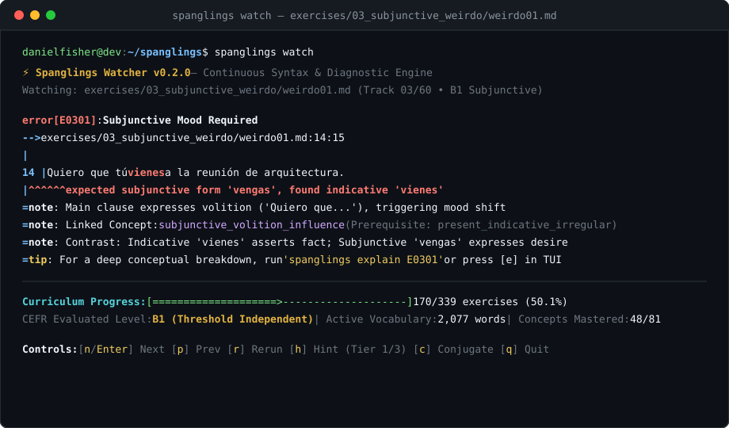

# Spanglings 🇪🇸 🦀

[](https://github.com/dnf0/spanglings/actions)
[](https://github.com/dnf0/spanglings/blob/main/LICENSE-MIT)
[](https://www.rust-lang.org/)
[](playground/index.html)
[](syllabus.md)
[](syllabus.md)

> **Spanglings builds the syntax compiler; real-world usage supplies the data.**  
> A developer-grade Spanish language learning system featuring a comprehensive reference manual, a zero-install WebAssembly interactive playground, and an interactive terminal TUI.

---

<div class="grid cards" markdown>

-   :material-book-open-page-variant:{ .lg .middle } __Spanish Language Manual__

    ---

    Master all **24 pedagogical topics** with dual-layer explanations: cognitive communicative mental models and compiler-grade grammar decision matrices.

    [:octicons-arrow-right-24: Read Spanish Language Manual](manual.md)

-   :material-lightning-bolt:{ .lg .middle } __Interactive Web Playground__

    ---

    Practice in your browser with zero installation. Experience the **Curriculum Syntax Studio** (with Monaco editor) and the real-time **Rapid Arcade Arena** powered by compiled WebAssembly.

    [:octicons-arrow-right-24: Launch Web Playground](playground/index.html)

-   :material-format-list-bulleted-type:{ .lg .middle } __Curriculum Syllabus__

    ---

    Explore the complete curriculum: **24 topics**, **136 sentence frames**, and **262 arcade showdown duels** structured across 3 CEFR tiers.

    [:octicons-arrow-right-24: View Curriculum Syllabus](syllabus.md)

</div>

---

<p align="center">
  
</p>

Inspired by [Rustlings](https://github.com/rust-lang/rustlings) and [Raylings](https://github.com/dnf0/raylings), **Spanglings** provides a developer-grade learning environment for engineers and power users who want to master authentic Spanish syntax, aspectual geometry (*pretérito vs imperfecto*), subjunctive triggers, accidental *se*, and technical collocations without childish gamification.

---

## 🏛️ Language Architecture: 24 Topics across 3 CEFR Tiers

Spanglings categorizes the entire Spanish grammar continuum into 24 core pedagogical domains across 3 CEFR competency tiers:

### 🟢 Tier 1: Foundations & Aspectual Geometry (A1–A2)
Fundamental syntactic distinctions and morphosyntactic mechanics:
- **Ser vs. Estar** (`#ser-estar`): Essence & identity vs. transient state, posture, and location.
- **Por vs. Para** (`#por-para`): Backward motive & trajectory vs. forward goal, recipient & deadline.
- **Past Tenses & Aspect** (`#past-tenses`): Completed bounded events (preterite) vs. narrative background (imperfect).
- **Pronoun Stacking** (`#pronouns`): Indirect and direct object clitic ordering and the *se lo* rule.
- **Verbs like Gustar** (`#gustar`): Inverted experiential argument structures.
- **Reflexive Verbs** (`#reflexive`): Inherent, reciprocal, and middle-voice pronominal markers.
- **Stem-Changing Verbs** (`#stem-changing`): Radical vowel alternations in stressed present stems.
- **Prepositional Regimen** (`#prepositions`): Bound prepositions (*soñar con*, *insistir en*, *acordarse de*).

### 🟡 Tier 2: Mood, Triggers & Pragmatic Voice (B1–B2)
Modality, hypothetical conditions, and non-agentive structures:
- **Present Subjunctive** (`#subjunctive`): Volition, emotion, doubt, and non-existent antecedents.
- **Imperfect Subjunctive** (`#imperfect-subjunctive`): Counterfactual *si*-clauses and hypothetical requests.
- **Imperative Mood** (`#imperative`): Affirmative vs. negative commands and clitic binding.
- **Accidental "Se"** (`#accidental-se`): De-agentified involuntary events (*se me cayó*).
- **Passive vs. Impersonal "Se"** (`#passive-impersonal-se`): Agentless passives and general human agents.
- **Possessive Datives** (`#possessive-datives`): Inalienable possession with definite articles.
- **Relative Pronouns** (`#relative-pronouns`): Restrictive vs. non-restrictive clauses (*que*, *quien*, *el que*, *cuyo*).
- **Gerund Syntax Rules** (`#gerund-rules`): Simultaneous adverbial modification vs. forbidden adjective gerunds.

### 🟣 Tier 3: Advanced Nuance, Registers & Edge Mechanics (B2–C1)
Subtle semantic shifts, pragmatic discourse markers, and specialized domains:
- **Verbs of Becoming** (`#verbs-of-becoming`): Nuanced transformations (*ponerse*, *quedarse*, *hacerse*, *volverse*, *convertirse en*).
- **Scalar Concession** (`#scalar-concession`): Intensive concessive polarity (*por mucho que*, *aun a riesgo de que*).
- **Epistemic Conjecture** (`#epistemic-conjecture`): Future and conditional of probability (*serán las 4*, *estaría cansado*).
- **Adversatives & Rectification** (`#adversatives`): Restrictive *pero* vs. exclusive corrective *sino* / *sino que*.
- **False Friends** (`#false-friends`): Deceptive cognates (*actualmente*, *embarazada*, *constipado*).
- **Voseo Conjugation** (`#voseo`): Rioplatense second-person singular morphology (*vos tenés*, *vos podés*).
- **Software & Tech Spanish** (`#tech`): Authentic engineering, cloud, and systems vocabulary.
- **Legal & Statutory Spanish** (`#legal`): Formal administrative and statutory registers.

👉 Explore the complete rules and decision trees in the [📘 Spanish Language Manual](manual.md) or practice live in the [⚡ Interactive Playground](playground/index.html).

---

## 💡 Pedagogical Model: The Dual-Layer Approach

Every concept in Spanglings is taught through a dual-layer cognitive model:

| Layer | Component | Focus |
| :--- | :--- | :--- |
| **💡 Layer 1** | **Communicative Mental Model** | Intuitive cognitive metaphors that explain *why* native speakers choose a specific construction in real conversation. |
| **📐 Layer 2** | **Structural Decision Matrix** | Strict grammatical rules, scope triggers, exception matrices, and morphological transformations. |

---

## ⚡ Quickstart

=== "Interactive Web Playground (Zero Install)"
    Practice directly in your browser with zero installation:  
    👉 **[Launch Spanglings Interactive Playground](playground/index.html)**

=== "Cargo (Recommended)"
    ```bash
    # Install globally from crates.io
    cargo install spanglings

    # Initialize exercise catalog in current directory
    spanglings init

    # Start interactive terminal TUI
    spanglings

    # Query in-terminal grammar cheat sheets
    spanglings explain ser-estar
    spanglings explain por-para
    ```

=== "Build from Source"
    ```bash
    git clone https://github.com/dnf0/spanglings.git
    cd spanglings
    cargo build --release
    ./target/release/spanglings init
    ./target/release/spanglings
    ```

---

## 🌐 The *lings Ecosystem

If you enjoy hands-on, terminal-driven mastery, check out our companion platforms:

- ☸️ [**Kubelings**](https://github.com/dnf0/kubelings) – Hands-on interactive CLI learning environment for Kubernetes.
- 🏗️ [**Terralings**](https://github.com/dnf0/terralings) – Master Terraform and OpenTofu through interactive infrastructure-as-code exercises.
- ⚡ [**Raylings**](https://github.com/dnf0/raylings) – Learn distributed AI, Ray Core actors, and scalable clusters through hands-on Python exercises.
- 🦀 [**Rustlings**](https://github.com/rust-lang/rustlings) – Small exercises to get you used to reading and writing Rust code.
