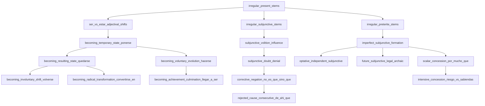

# Curriculum Syllabus & Knowledge Graph

The Spanglings curriculum comprises **339 handcrafted exercises** organized across **60 thematic tracks** spanning CEFR Baseline (A1–A2), Intermediate (B1), Upper-Intermediate (B2), and Advanced (C1).

All exercises are mapped into an **81-concept Directed Acyclic Graph (DAG) ontology** that tracks prerequisite dependencies and powers personalized weakness profiling and adaptive placement.

---

## 🗺️ 24 Core Curriculum Topics & Studio Hub

Spanglings structures the entirety of Spanish syntax into **24 targeted pedagogical domains** across three developmental tiers. Each domain is fully covered with cognitive mental models and decision matrices in the [Spanish Language Manual](manual.md), and executable in real-time in the [Interactive Playground](../playground/).

### 🟢 Tier 1: Foundations & Aspectual Geometry (A1–A2)

| # | Topic | CEFR | Grammatical Core | Reference Manual | Interactive Practice |
| :-: | :--- | :---: | :--- | :--- | :--- |
| 1 | **Ser vs. Estar** | A1–A2 | Essence & Identity vs. State, Condition & Location; Adjectival meaning shifts | [📘 Ser vs. Estar](manual.md#ser-estar) | [⚡ Studio](../playground/?topic=ser-estar) • [⚔️ Arcade](../playground/?mode=arcade&topic=ser-estar) |
| 2 | **Por vs. Para** | A1–A2 | Cause, Trajectory & Means vs. Goal, Recipient & Deadline | [📘 Por vs. Para](manual.md#por-para) | [⚡ Studio](../playground/?topic=por-para) • [⚔️ Arcade](../playground/?mode=arcade&topic=por-para) |
| 3 | **Past Tenses & Aspect** | A1–A2 | Preterite (completed bounded event) vs. Imperfect (ongoing background/habitual) | [📘 Past Tenses](manual.md#past-tenses) | [⚡ Studio](../playground/?topic=past-tenses) • [⚔️ Arcade](../playground/?mode=arcade&topic=past-tenses) |
| 4 | **Pronoun Stacking** | A1–A2 | Clitic pronoun ordering (`se lo`), verb attachments (infinitives/gerunds/imperatives) | [📘 Pronoun Stacking](manual.md#pronouns) | [⚡ Studio](../playground/?topic=pronouns) • [⚔️ Arcade](../playground/?mode=arcade&topic=pronouns) |
| 5 | **Verbs like Gustar** | A1–A2 | Inverted dative syntax, stimulus-as-subject agreement (`me gusta / me gustan`) | [📘 Verbs like Gustar](manual.md#gustar) | [⚡ Studio](../playground/?topic=gustar) • [⚔️ Arcade](../playground/?mode=arcade&topic=gustar) |
| 6 | **Reflexive Verbs** | A1–A2 | Direct reflexives, reciprocal actions, inchoative aspectual shifts (*dormirse*, *irse*) | [📘 Reflexive Verbs](manual.md#reflexive) | [⚡ Studio](../playground/?topic=reflexive) • [⚔️ Arcade](../playground/?mode=arcade&topic=reflexive) |
| 7 | **Stem-Changing Verbs** | A1–A2 | Radical boot shifts (*e→ie*, *o→ue*, *e→i*), vocalic stress rules | [📘 Stem-Changing](manual.md#stem-changing) | [⚡ Studio](../playground/?topic=stem-changing) • [⚔️ Arcade](../playground/?mode=arcade&topic=stem-changing) |
| 8 | **Prepositional Regimen** | A1–A2 | Fixed verbal prepositions (*depender de*, *soñar con*, *insistir en*, *renunciar a*) | [📘 Prepositional Regimen](manual.md#prepositions) | [⚡ Studio](../playground/?topic=prepositions) • [⚔️ Arcade](../playground/?mode=arcade&topic=prepositions) |

---

### 🟡 Tier 2: Mood, Triggers & Pragmatic Voice (B1–B2)

| # | Topic | CEFR | Grammatical Core | Reference Manual | Interactive Practice |
| :-: | :--- | :---: | :--- | :--- | :--- |
| 9 | **Present Subjunctive** | B1 | WEIRDO triggers, volition, doubt, emotion, non-existent relative antecedents | [📘 Present Subjunctive](manual.md#subjunctive) | [⚡ Studio](../playground/?topic=subjunctive) • [⚔️ Arcade](../playground/?mode=arcade&topic=subjunctive) |
| 10 | **Imperfect Subjunctive** | B1–B2 | Hypothetical counterfactual *si*-clauses, polite requests (*quisiera*), *-ra* vs. *-se* | [📘 Imperfect Subjunctive](manual.md#imperfect-subjunctive) | [⚡ Studio](../playground/?topic=imperfect-subjunctive) • [⚔️ Arcade](../playground/?mode=arcade&topic=imperfect-subjunctive) |
| 11 | **Imperative Mood** | B1 | Affirmative vs negative commands, irregular forms, clitic pronoun attachment rules | [📘 Imperative Mood](manual.md#imperative) | [⚡ Studio](../playground/?topic=imperative) • [⚔️ Arcade](../playground/?mode=arcade&topic=imperative) |
| 12 | **Accidental "Se"** | B1 | Non-agentive unintentional events (*se me cayó*, *se nos olvidaron los accesos*) | [📘 Accidental Se](manual.md#accidental-se) | [⚡ Studio](../playground/?topic=accidental-se) • [⚔️ Arcade](../playground/?mode=arcade&topic=accidental-se) |
| 13 | **Passive & Impersonal "Se"** | B1–B2 | Agreement in passive *se* (*se publican artículos*) vs invariable impersonal (*se atiende a*) | [📘 Passive & Impersonal Se](manual.md#passive-impersonal-se) | [⚡ Studio](../playground/?topic=passive-impersonal-se) • [⚔️ Arcade](../playground/?mode=arcade&topic=passive-impersonal-se) |
| 14 | **Possessive Datives** | B1–B2 | Datives of inalienable possession (*me lavé las manos*), ethic & affective datives | [📘 Possessive Datives](manual.md#possessive-datives) | [⚡ Studio](../playground/?topic=possessive-datives) • [⚔️ Arcade](../playground/?mode=arcade&topic=possessive-datives) |
| 15 | **Relative Pronouns** | B1–B2 | Restrictive vs non-restrictive relative clauses (*que*, *quien*, *el cual*, *el que*, *cuyo*) | [📘 Relative Pronouns](manual.md#relative-pronouns) | [⚡ Studio](../playground/?topic=relative-pronouns) • [⚔️ Arcade](../playground/?mode=arcade&topic=relative-pronouns) |
| 16 | **Gerund Rules** | B1–B2 | Simultaneous/modal gerunds vs banned posteriority and illegal adjectival gerunds | [📘 Gerund Rules](manual.md#gerund-rules) | [⚡ Studio](../playground/?topic=gerund-rules) • [⚔️ Arcade](../playground/?mode=arcade&topic=gerund-rules) |

---

### 🟣 Tier 3: Advanced Nuance, Registers & Edge Mechanics (B2–C1)

| # | Topic | CEFR | Grammatical Core | Reference Manual | Interactive Practice |
| :-: | :--- | :---: | :--- | :--- | :--- |
| 17 | **Verbs of Becoming** | B2–C1 | Dynamic transformation (*ponerse*, *quedarse*, *hacerse*, *volverse*, *convertirse en*) | [📘 Verbs of Becoming](manual.md#verbs-of-becoming) | [⚡ Studio](../playground/?topic=verbs-of-becoming) • [⚔️ Arcade](../playground/?mode=arcade&topic=verbs-of-becoming) |
| 18 | **Scalar Concession** | B2–C1 | Intensive concession (*por más que*, *por muy + adj + que*, *aun a riesgo de que*) | [📘 Scalar Concession](manual.md#scalar-concession) | [⚡ Studio](../playground/?topic=scalar-concession) • [⚔️ Arcade](../playground/?mode=arcade&topic=scalar-concession) |
| 19 | **Epistemic Conjecture** | B2–C1 | Future and conditional of probability (*serán las 4*, *estaría ocupado*) vs strict fact | [📘 Epistemic Conjecture](manual.md#epistemic-conjecture) | [⚡ Studio](../playground/?topic=epistemic-conjecture) • [⚔️ Arcade](../playground/?mode=arcade&topic=epistemic-conjecture) |
| 20 | **Adversatives & Rectification** | B2–C1 | Restrictive *pero* vs exclusive substitution *sino* / *sino que* | [📘 Adversatives](manual.md#adversatives) | [⚡ Studio](../playground/?topic=adversatives) • [⚔️ Arcade](../playground/?mode=arcade&topic=adversatives) |
| 21 | **False Friends & Cognates** | B2–C1 | Deceptive cognates in professional contexts (*actual*, *realizar*, *pretender*, *eventual*) | [📘 False Friends](manual.md#false-friends) | [⚡ Studio](../playground/?topic=false-friends) • [⚔️ Arcade](../playground/?mode=arcade&topic=false-friends) |
| 22 | **Voseo & Regional Address** | B2–C1 | Rioplatense & Central American voseo conjugations (*vos podés*, *tené*, *mirá*) | [📘 Voseo](manual.md#voseo) | [⚡ Studio](../playground/?topic=voseo) • [⚔️ Arcade](../playground/?mode=arcade&topic=voseo) |
| 23 | **Technical & Software Spanish** | B2–C1 | Authentic engineering vocabulary (*desplegar*, *depurar*, *concurrencia*, *repositorio*) | [📘 Tech Spanish](manual.md#tech) | [⚡ Studio](../playground/?topic=tech) • [⚔️ Arcade](../playground/?mode=arcade&topic=tech) |
| 24 | **Legal & Statutory Spanish** | B2–C1 | Contractual prose, formal obligations, and statutory future subjunctive (`-ere`) | [📘 Legal Spanish](manual.md#legal) | [⚡ Studio](../playground/?topic=legal) • [⚔️ Arcade](../playground/?mode=arcade&topic=legal) |

---

## 📊 60-Track Curriculum Catalog Matrix

### 🟢 Baseline Foundations (A1–A2) • 16 Exercises
| Track | Name | CEFR | Exercises | Key Concepts Covered |
| :--- | :--- | :--- | :---: | :--- |
| `00_baseline` | Irregular Preterite Foundations | A1–A2 | 5 | Irregular preterite stems (*hice*, *tuve*, *pude*, *supe*, *puse*) |
| `01_ser_vs_estar` | Ser vs Estar Fundamental Contrast | A1–A2 | 5 | Essential identity vs temporary state and location |
| `02_past_aspects` | Preterite vs Imperfect Aspect | A1–A2 | 6 | Aspectual boundaries, narrative background, habitual past |

---

### 🟡 Intermediate Core (B1) • 74 Exercises
| Track | Name | CEFR | Exercises | Key Concepts Covered |
| :--- | :--- | :--- | :---: | :--- |
| `03_subjunctive_weirdo` | Subjunctive Volition, Emotion & Doubt | B1 | 6 | WEIRDO triggers (*querer que*, *alegrarse de que*, *dudar que*) |
| `04_subjunctive_relative` | Subjunctive in Relative Clauses | B1 | 5 | Indefinite/non-existent antecedents (*busco un servidor que tenga...*) |
| `05_subjunctive_conjunctions` | Temporal & Adverbial Conjunctions | B1 | 6 | *En cuanto*, *tan pronto como*, *hasta que*, *para que* |
| `06_imperfect_subjunctive_conditionals` | Hypothetical Si-Clauses & Imperfect Subjunctive | B1–B2 | 6 | *Si tuviera tiempo, optimizaría el código*, *-ra* vs *-se* morphology |
| `07_por_vs_para` | Cause, Motive vs Goal, Purpose | B1 | 6 | Cause/medium/exchange (*por*) vs destination/deadline/goal (*para*) |
| `08_pronoun_stacking` | Clitic Pronoun Placement & Stacking | B1 | 5 | Double clitics (*se lo*), positional attachment to infinitives and gerunds |
| `09_prepositional_regimes` | Prepositional Regimes (*Régimen Preposicional*) | B1 | 6 | Fixed verb prepositions (*soñar con*, *depender de*, *insistir en*) |
| `10_accidental_se` | Involuntary & Accidental Events | B1 | 5 | Pragmatic de-agentification (*se me cayó*, *se le borraron los datos*) |
| `49_clitic_doubling_and_left_dislocation` | Clitic Doubling & Left Dislocation | B1–B2 | 6 | Mandatory dative doubling (*A mí me parece*), topicalized direct objects |
| `50_personal_a_and_animacy_shifts` | Differential Object Marking (Personal A) | B1–B2 | 6 | Specific human direct objects, animal personification, verb semantic shifts |
| `52_adversative_pero_sino_sino_que` | Adversative Pero, Sino & Sino Que | B1–B2 | 6 | Restrictive addition (*pero*) vs exclusive substitution (*sino / sino que*) |
| `55_epistemic_adverbs_and_mood_selection` | Epistemic Adverbs & Mandatory Mood | B1–B2 | 6 | Non-negotiable indicative (*a lo mejor*, *igual*) vs variable (*quizás*, *tal vez*) |
| `56_datives_of_possession_and_ethic_datives` | Datives of Possession & Affective Clitics | B1–B2 | 6 | Inalienable body parts (*lavarse las manos*), ethic datives (*¡no me llores!*, *se nos cayó*) |

---

### 🔵 Upper-Intermediate Mastery (B2) • 95 Exercises
| Track | Name | CEFR | Exercises | Key Concepts Covered |
| :--- | :--- | :--- | :---: | :--- |
| `11_pluperfect_subjunctive` | Pluperfect Subjunctive in Counterfactuals | B2 | 5 | Past impossible conditions (*si hubiera sabido, habría actuado*) |
| `12_verbal_periphrases` | Aspectual Verbal Periphrases | B2 | 5 | Inceptive, durative, terminative (*ponerse a*, *acabar de*, *llevar + gerundio*) |
| `13_advanced_concessives` | Concessive Mood Alternation | B2 | 5 | *Aunque* with indicative (fact) vs subjunctive (uncertain hypothesis) |
| `14_connectors` | Discourse Markers & Logical Connectors | B2 | 5 | *Por ende*, *sin embargo*, *no obstante*, *a fin de cuentas* |
| `15_indirect_speech` | Reported Speech & Tense Concordance | B2 | 5 | Sequence of tenses (*dijo que vendría*, *preguntó si habíamos terminado*) |
| `16_idioms` | Fixed Idiomatic Expressions | B2 | 5 | *Costar un ojo de la cara*, *tomar el pelo*, *hacer la vista gorda* |
| `17_negated_perception` | Negated Perception & Subjunctive Triggers | B2 | 5 | *No veo que sea*, *no parece que tenga*, epistemic assertion vs doubt |
| `18_cleft_sentences` | Cleft Sentences & Focalization | B2 | 5 | *Fue ayer cuando*, *lo que necesitamos es*, syntactic focalization |
| `19_formal_inversion` | Syntactic Inversion in Formal Registers | B2 | 5 | *No bien llegó el paquete...*, stylistic word-order inversion |
| `20_passive_refleja` | Passive Refleja vs Impersonal Se | B2 | 5 | Agreement with subject (*se publican artículos*) vs impersonal (*se atiende a los usuarios*) |
| `21_nuanced_collocations` | High-Frequency Nuanced Collocations | B2 | 5 | Precise collocational pairings in technical and academic domains |
| `22_tech_software` | Software Engineering & Cloud Operations | B2 | 5 | Git workflows, refactoring, microservices, deployments, concurrency |
| `23_business_diplomatic` | Corporate Negotiations & Diplomatic Spanish | B2 | 5 | Commercial agreements, polite requests, executive correspondence |
| `24_false_friends` | Pragmatic False Friends (Anglicisms) | B2 | 5 | *Eventual* (possible) vs *final*, *constipado* (cold) vs *estreñido*, *realizar* vs *darse cuenta* |
| `25_register_elevation` | Register Elevation & Rhetorical Precision | B2 | 5 | Transforming colloquial phrases into elevated administrative prose |
| `26_regional_contrasts` | Regional Syntactic & Lexical Contrasts | B2 | 5 | Peninsular vs Latin American usage (*coche/carro*, *ordenador/computadora*) |
| `48_epistemic_conjecture_and_probability` | Epistemic Future & Conditional Conjecture | B2–C1 | 6 | Present probability (*serán las 4*), past conjecture (*estaría cansado*), compound conjecture |
| `54_verbs_of_becoming_and_transformation` | Verbs of Becoming & Transformation | B2–C1 | 6 | *Ponerse* (temporary/emotion), *quedarse* (result/loss), *hacerse* (effort/career), *volverse* (character), *convertirse en* |
| `57_corrective_and_concessive_polarities` | Corrective Negation & Rejected Causes | B2–C1 | 6 | *No es que [subj]... sino que [ind]*, *no porque [subj]*, *de ahí que [subj]* |

---

### 🟣 Advanced & Situational Synthesis (C1) • 154 Exercises
| Track | Name | CEFR | Exercises | Key Concepts Covered |
| :--- | :--- | :--- | :---: | :--- |
| `27_system_design` | Distributed Systems & Architecture | C1 | 6 | High availability, event-driven pipelines, CAP theorem tradeoffs |
| `28_advanced_subjunctive_clauses` | Reduplicative Concessives & Dubitatives | C1 | 6 | *Haga lo que haga*, *sea como fuere*, *por difícil que resulte* |
| `29_advanced_verbal_periphrases` | Nuanced Aspectual & Modal Periphrases | C1 | 6 | *Dar en*, *venir a*, *tener por*, *dar por sentado* |
| `30_executive_leadership` | Executive Strategy & Governance | C1 | 6 | Board presentations, stakeholder alignment, risk mitigation |
| `31_mexican_tech_and_startups` | Mexican Tech Ecosystem & Startups | C1 | 6 | Mexican engineering idioms, local payment gateways, tech hubs |
| `32_colombian_professional_nuances` | Colombian Enterprise Pragmatics | C1 | 6 | Formal courtesy formulas, contractual negotiations in Bogotá/Medellín |
| `33_rioplatense_production_voseo` | Rioplatense Professional Voseo | C1 | 6 | Voseo imperative (*mirá*, *hacé*, *tené*), present indicative (*vos podés*), tech jargon |
| `34_latam_anglicism_elimination` | Latin American Anglicism Elimination | C1 | 6 | Replacing raw Anglicisms (*deployar*, *loguearse*) with standard native Spanish |
| `35_latam_enterprise_risk_and_sla` | Latin American Enterprise SLA & Risk | C1 | 6 | Vendor SLAs, contractual warranties, high-stakes infrastructure negotiations |
| `36_everyday_life_and_housing` | Housing, Leases & Bureaucracy | C1 | 6 | Rental guarantees (*fianza*), utility hookups (*dar de alta*), tax ID (*NIE/NIF*) |
| `37_healthcare_and_symptoms` | Medical Consultations & Health | C1 | 6 | Describing acute pain (*punzadas*), prescription dosages, medical discharge (*alta*) |
| `38_dining_and_social_conversation` | Social Gatherings, Banter & Hospitality | C1 | 6 | Splitting the bill (*pagar a escote*), casual meetup idioms (*quedar*), idiomatic banter |
| `39_nuanced_prepositions_and_locutions` | Nuanced Prepositional Locutions | C1 | 6 | *Hacia* vs *hasta*, *tras*, *según*, *a base de*, *a expensas de* |
| `40_middle_voice_and_reflexive_shifts` | Middle Voice & Telic Reflexives | C1 | 6 | Inchoative shifts (*dormirse*, *irse*), exhaustive consumption (*comerse*, *beberse*) |
| `41_adverbial_clauses_and_conjunctions` | Advanced Concessive & Manner Clauses | C1 | 6 | *A medida que*, *conforme*, *en tanto que*, *salvo que* |
| `42_travel_logistics_and_borders` | International Travel, Customs & Border Control | C1 | 6 | Passport control, baggage claims (*reclamación de equipaje*), transit visas |
| `43_banking_taxes_and_finances` | Corporate Banking, Taxes & Fiscal Filings | C1 | 6 | Quarterly VAT (*IVA trimestral*), income withholdings (*IRPF*), SEPA wire transfers |
| `44_consumer_complaints_and_rights` | Consumer Rights & Legal Claims | C1 | 6 | Formal grievance forms (*hoja de reclamaciones*), warranty disputes, chargebacks |
| `45_home_maintenance_and_repairs` | Utility Infrastructure & Domestic Repairs | C1 | 6 | Electrical breaker panels (*cuadro eléctrico*), plumbing leaks (*fuga*), boiler faults |
| `46_news_media_and_civic_debate` | News Media, Editorial & Policy Analysis | C1 | 6 | Economic trends, policy debates, investigative journalism, neutral attribution |
| `47_conversational_markers_and_nuance` | Conversational Pragmatics & Subtle Stance | C1 | 6 | Irony markers, pragmatic hedges (*¡qué va!*, *ni hablar*), smooth transitions |
| `51_gerund_restrictions_and_anglicisms` | Gerund Restrictions & Anglicisms | B2–C1 | 6 | Gerund of posteriority prohibition, adjectival gerund avoidance (*que regula*) |
| `53_independent_subjunctives_and_legal_tenses` | Optatives & Statutory Future Subjunctive | C1 | 6 | Exclamatory counterfactuals (*¡Quién pudiera!*), statutory texts (*incumpliere*) |
| `58_participial_absolute_constructions` | Participial Absolute Constructions | C1 | 6 | Preposed absolute clauses (*Concluida la auditoría...*), strict gender/number agreement |
| `59_scalar_concession_and_intensive_connectors` | Scalar Concession & Intensive Connectors | C1 | 6 | *Por mucho que [subj]*, *por muy + adj + que [subj]*, *aun a riesgo de que* vs *aun a sabiendas de que* |

---

## 🌐 The 81-Concept Linguistic Knowledge Graph

Spanglings compiles a static, cycle-free Directed Acyclic Graph (DAG) modeling pedagogical dependencies between all 81 grammatical concepts across 7 categories:

### Key Graph Primitives
- **Node**: A linguistic concept with an identifier (e.g. `becoming_temporary_state_ponerse`), title, CEFR level, category, and explanation.
- **Edge**: Prerequisite link indicating that concept $A$ should be mastered before concept $B$.
- **Learning Frontier**: Computes the set of unmastered concepts whose prerequisites have all been fulfilled ($M \ge 70\%$).
- **Weakest Concept Root**: Traverses prerequisite chains to pinpoint the root gap causing downstream errors.
