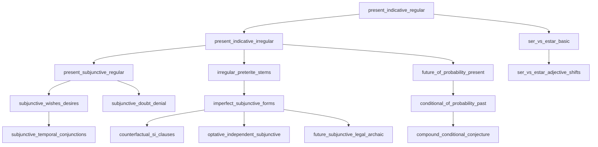

# Curriculum Syllabus & Knowledge Graph

The Spanglings curriculum comprises **303 handcrafted exercises** organized across **54 thematic tracks** spanning CEFR Baseline (A1–A2), B1, B2, and C1.

All exercises are mapped into a **66-concept Directed Acyclic Graph (DAG) ontology** that tracks prerequisite dependencies and powers personalized weakness profiling.

---

## 📊 Curriculum Track Matrix

### 🟢 Baseline Foundations (A1–A2) • 15 Exercises
| Track | Name | CEFR | Exercises | Key Concepts Covered |
| :--- | :--- | :--- | :---: | :--- |
| `00_baseline` | Irregular Preterite Foundations | A1–A2 | 5 | Irregular preterite stems (*hice*, *tuve*, *pude*, *supe*, *puse*) |
| `01_baseline_imperfect` | Imperfect Aspect & Habitual Past | A1–A2 | 5 | Habitual imperfect markers (*iba*, *era*, *veía*, descriptions) |
| `02_baseline_ser_estar` | Ser vs Estar Identity & State | A1–A2 | 5 | Essential identity vs temporary conditions and locations |

---

### 🟡 Intermediate Core (B1) • 93 Exercises
| Track | Name | CEFR | Exercises | Key Concepts Covered |
| :--- | :--- | :--- | :---: | :--- |
| `03_subjunctive_weirdo` | Subjunctive Volition, Emotion & Doubt | B1 | 5 | WEIRDO triggers (*querer que*, *alegrarse de que*, *dudar que*) |
| `04_por_vs_para` | Motive vs Purpose Regimes | B1 | 5 | Cause/exchange (*por*) vs deadline/destination/recipient (*para*) |
| `05_clitic_pronoun_stacking` | Direct & Indirect Object Placement | B1 | 5 | Double clitics (*se lo*), pronoun attachment with infinitives/gerunds |
| `06_accidental_se` | Involuntary & Accidental Events | B1 | 5 | *Se me cayó*, *se le olvidó*, unintentional agency framing |
| `07_reflexive_nuance` | Transitive vs Middle-Voice Reflexives | B1 | 5 | *Ir* vs *irse*, *dormir* vs *dormirse*, *llevar* vs *llevarse* |
| `08_relative_pronouns` | Restrictive & Non-Restrictive Clauses | B1 | 5 | *Que*, *quien*, *el cual*, *cuyo*, *lo que* abstractions |
| `09_passive_voice` | Passive *Se* & Impersonal Formulations | B1 | 5 | *Se venden pisos*, *se busca desarrollador*, passive participles |
| `10_conditional_si_clauses` | Real & Potential Hypotheticals | B1 | 5 | *Si + presente -> futuro*, *Si + imperfecto subjuntivo -> condicional* |
| `11_prepositional_regimes` | Bound Prepositions (*Regímenes*) | B1 | 5 | *Pensar en*, *soñar con*, *acordarse de*, *insistir en* |
| `12_periphrastic_aspect` | Verbal Periphrases & Inchoative Aspect | B1 | 5 | *Ponerse a*, *acabar de*, *soler*, *llevar + gerundio*, *dejar de* |
| `13_indirect_discourse` | Reported Speech & Tense Concordance | B1 | 5 | *Dijo que vendría*, Sequence of tenses (*consecutio temporum*) |
| `14_adverbial_clauses` | Concessive & Temporal Subjunctive | B1 | 5 | *Aunque* (fact vs hypothetical), *antes de que*, *sin que* |
| `15_diminutives_augmentatives` | Pragmatic Suffixation & Softening | B1 | 5 | *-ito*, *-illo*, *-azo*, discourse softening, situational affection |
| `16_comparatives_superlatives` | Nuanced Scales & Relative Quantities | B1 | 5 | *Tanto como*, *de lo que*, *mayor/menor*, absolute superlatives |
| `17_imperative_mood` | Directives & Clipped Commands | B1 | 5 | Affirmative *tú* irregulars (*haz*, *pon*, *ten*), negative subjunctive |
| `49_clitic_doubling_and_left_dislocation` | Clitic Doubling & Left Dislocation | B1–B2 | 6 | Mandatory dative doubling (*A mí me parece*), psych-verbs, topicalization |
| `50_personal_a_and_animacy_shifts` | Personal A & Animacy Shifts | B1–B2 | 6 | Specific humans vs generic roles, *al perro*, semantic shift of *tener* & *perder* |
| `52_adversative_pero_sino_sino_que` | Adversative Pero, Sino & Sino Que | B1–B2 | 6 | Additive contrast (*pero*) vs exclusive substitution (*sino* / *sino que + verbo*) |

---

### 🔵 Upper-Intermediate Mastery (B2) • 96 Exercises
| Track | Name | CEFR | Exercises | Key Concepts Covered |
| :--- | :--- | :--- | :---: | :--- |
| `18_subjunctive_past` | Imperfect Subjunctive In-Depth | B2 | 5 | *-ra* vs *-se* endings, past triggers, hypothetical counterfactuals |
| `19_subjunctive_perfect` | Present & Past Perfect Subjunctive | B2 | 5 | *Haya hablado*, *hubiera sabido*, anteriority in subordinate clauses |
| `20_mixed_counterfactuals` | Past Conditionals & Mixed Si-Clauses | B2 | 5 | *Habría sido*, *Si hubieras venido, estaríamos listos hoy* |
| `21_nominalization` | Neuter Article *Lo* & Abstract Heads | B2 | 5 | *Lo bueno*, *lo difícil de*, *lo que más me preocupa* |
| `22_discourse_markers` | Pragmatic Connectors & Argumentation | B2 | 5 | *Sin embargo*, *por lo tanto*, *en cambio*, *a pesar de ello* |
| `23_causative_factitive` | Delegated Actions & Causative *Hacer* | B2 | 5 | *Hacer hacer*, *mandar arreglar*, delegated execution |
| `24_evaluative_ser_estar` | Adjective Semantic Shifts with Copulas | B2 | 5 | *Ser listo* (clever) vs *estar listo* (ready), *ser/estar atento* |
| `25_spatial_temporal_locutions` | Complex Spatial & Temporal Anchors | B2 | 5 | *Al cabo de*, *a lo largo de*, *con respecto a*, *a raíz de* |
| `26_idiomatic_collocations` | Fixed Lexical Chunks & Idioms | B2 | 5 | *Dar en el clavo*, *hacer la vista gorda*, *tomar cartas en el asunto* |
| `27_technical_engineering` | Software, Git & Cloud Terminology | B2 | 5 | *Desplegar*, *rama*, *repositorio*, *concurrencia*, *carga* |
| `28_business_formal` | Corporate & Administrative Spanish | B2 | 5 | *Estimado/a*, *en respuesta a su solicitud*, formal register |
| `29_academic_essay` | Rhetorical Registers & Argumentative Prose | B2 | 5 | *Cabe destacar*, *en virtud de*, *se colige que* |
| `30_journalistic_media` | News Reporting & Attributive Clauses | B2 | 5 | *Fuentes oficiales aseguran*, passive headlines, neutral discourse |
| `31_legal_contracts` | Terms, Conditions & Legal Syntax | B2 | 5 | *Las partes acuerdan*, *cláusula de rescisión*, future subjunctive |
| `32_latam_tech_startups` | Latin American Tech & Engineering | B2 | 6 | Sprints, standups, rollbacks, Latin American workplace idioms |
| `33_latam_fintech_banking` | Latin American Fintech & Payments | B2 | 6 | Wallets, QR transactions, KYC verification, exchange regulations |
| `34_latam_cloud_devops` | LatAm DevOps & Cloud Architecture | B2 | 6 | Microservices, autoscaling, CI/CD pipelines, latency mitigation |
| `35_latam_business_negotiation` | LatAm Commercial Strategy & SLAs | B2 | 6 | Vendor SLAs, contract renewals, milestone deliverables |
| `48_epistemic_conjecture_and_probability` | Epistemic Future & Conditional Conjecture | B2–C1 | 6 | Present conjecture (*serán las 4*), past conjecture (*estaría enfermo*), compound forms |

---

### 🟣 Advanced & Situational Synthesis (C1) • 99 Exercises
| Track | Name | CEFR | Exercises | Key Concepts Covered |
| :--- | :--- | :--- | :---: | :--- |
| `36_everyday_life_housing` | Housing, Lease & Bureaucracy | C1 | 6 | Lease deposits (*fianza*), utilities (*dar de alta*), banking transfers |
| `37_healthcare_medical` | Medical Encounters & Symptoms | C1 | 6 | Acute symptoms (*punzadas*), dosages, ER discharge (*alta médica*) |
| `38_dining_social_banter` | Socializing, Small Talk & Nightlife | C1 | 6 | Split bills (*cuenta por separado*), meeting up (*quedar*), banter |
| `39_nuanced_prepositions` | Nuanced Prepositional Locutions | C1 | 6 | *Hacia* vs *Hasta*, *Tras*, *Según*, *A base de*, *A expensas de* |
| `40_middle_voice_aspect` | Aspectual Telic Shifts | C1 | 6 | *Comer* vs *Comerse*, *Dormir* vs *Dormirse*, *Volverse* |
| `41_adverbial_clauses_conjunctions` | Advanced Concessive & Manner Clauses | C1 | 6 | *A medida que*, *Conforme*, *En tanto que*, *Salvo que* |
| `42_practical_travel_logistics` | Rail, Air & Transit Logistics | C1 | 6 | Transit transfers, customs declarations, lost luggage compensation |
| `43_banking_taxes_financial` | Invoicing, Tax Returns & Retentions | C1 | 6 | VAT returns (*IVA trimestral*), withholdings (*IRPF*), fiscal residency |
| `44_consumer_rights_complaints` | Warranty Claims & Legal Disputes | C1 | 6 | Formal grievance claims (*hoja de reclamaciones*), chargebacks |
| `45_home_maintenance_repairs` | Electrical, Plumbing & Utilities | C1 | 6 | Fuse breakers (*diferencial*), plumbing leaks (*fuga de agua*), repairs |
| `46_news_media_editorial` | Socioeconomic Analysis & Editorial | C1 | 6 | Economic trends, policy debates, investigative reporting |
| `47_conversational_nuance_slang` | Pan-Hispanic Pragmatics & Colloquialisms | C1 | 6 | Irony, colloquial markers (*¡qué va!*, *ni hablar*), discourse flow |
| `51_gerund_restrictions_and_anglicisms` | Gerund Restrictions & Anglicisms | B2–C1 | 6 | Gerund of posteriority rejection, adjectival gerund elimination (*que regula*), *agua hirviendo* |
| `53_independent_subjunctives_and_legal_tenses` | Optatives & Legal Subjunctives | C1 | 6 | *¡Quién pudiera!*, independent wishes (*¡Que tengas éxito!*), legal future subjunctive (*incumpliere*) |

---

## 🌐 The 66-Concept Linguistic Knowledge Graph

Spanglings compiles a static, cycle-free Directed Acyclic Graph (DAG) modeling dependencies between grammatical concepts:

### Key Graph Primitives
- **Node**: A linguistic concept with an identifier (e.g. `optative_independent_subjunctive`), display name, CEFR level, category, and explanation.
- **Edge**: Prerequisite link indicating that concept $A$ should be mastered before concept $B$.
- **Learning Frontier**: Computes the set of unmastered concepts whose prerequisites have all been fulfilled ($M \ge 70\%$).

